# Jarkom-Modul-4-B13-2023

- Robby Ulung Pambudi (5025211042)
- Tsaqif Deniar Bhakti (5025211151)

## Problem

- Problem CIDR dengan CPT - Robby
- Problem VLSM dengan GNS3 - Tsaqif

## Problem CIDR dengan CPT

### Topologi

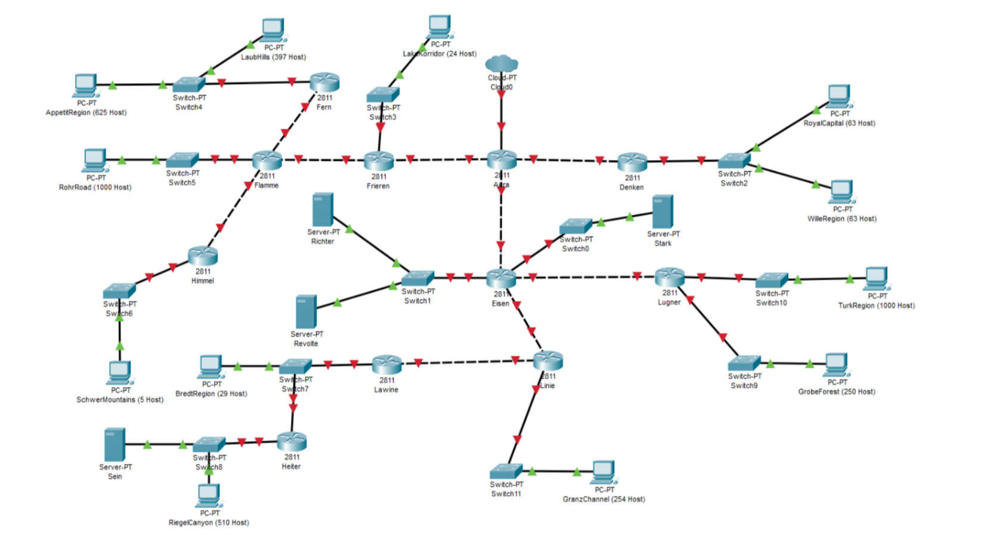

### Pembagian Subnet Awal

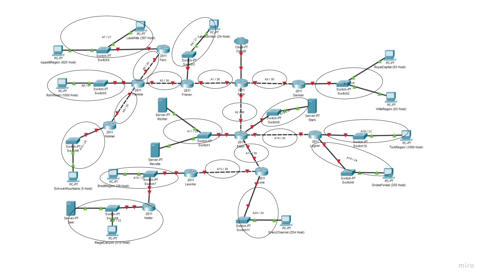

#### Gabungan Pertama Subnet B

- Gabungkan subnet A17 dan A16 menjadi satu subnet besar B01 dengan netmask /21

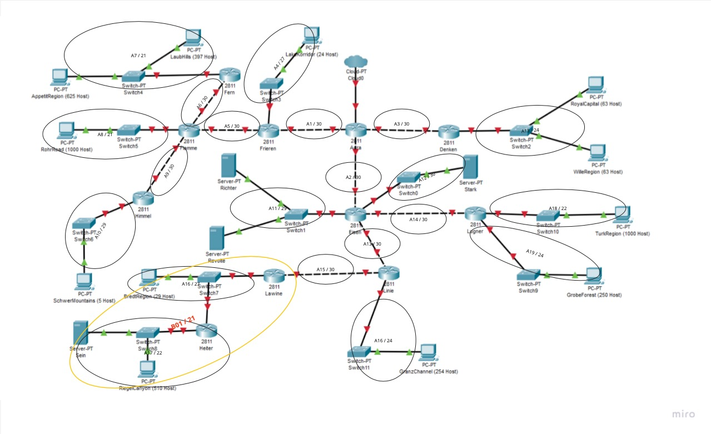

#### Gabungan Kedua Subnet C

- Penggabungan 1 : Gabungkan subnet B01 dan A15 menjadi satu subnet besar C01 dengan netmask /20
- Penggabungan 2 : Gabungan subnet A10 dan A9 menjadi satu subnet besar C02 dengan netmask /28
- Penggabungan 3 : Gabungkan subnet A7 dan A6 menjadi satu subnet besar C03 dengan netmask /20

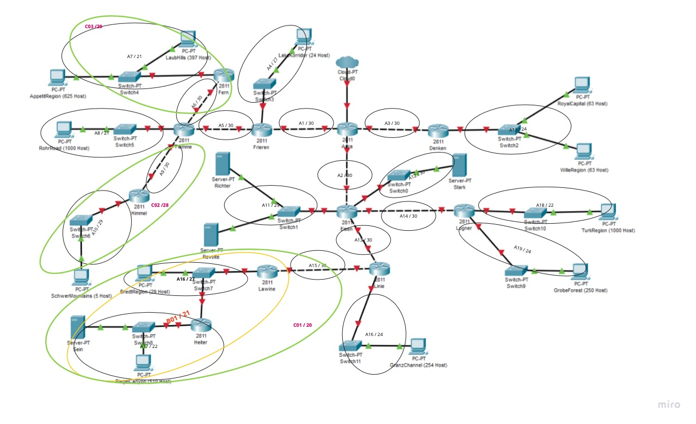

#### Gabungan Ketiga Subnet D

- Penggabungan 1 : Gabungkan subnet C03 dan A08 menjadi satu subnet besar D01 dengan netmask /19
- Penggabungan 2 : Gabungkan subnet C01 dan A16 menjadi satu subnet besar D02 dengan netmask /19
- Penggabungan 3 : Gabungkan subnet A18 dan A19 menjadi satu subnet besar D03 dengan netmask /23

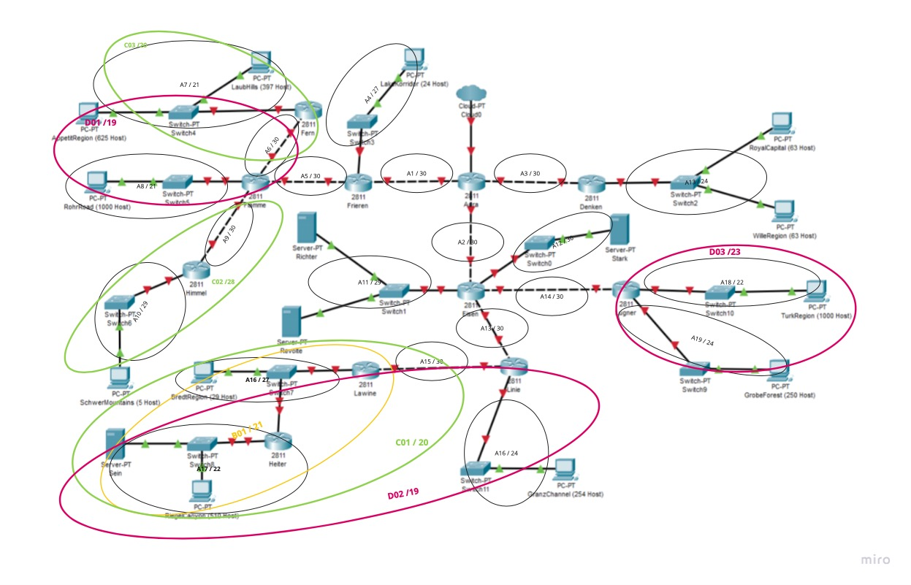

#### Gabungan Keempat Subnet E

- Penggabungan 1 : Gabungkan subnet D01 dan C02 menjadi satu subnet besar E02 dengan netmask /19
- Penggabungan 2 : Gabungkan subnet D02 dan A13 menjadi satu subnet besar E01 dengan netmask /18
- Penggabungan 3 : Gabungkan subnet D03 dan A14 menjadi satu subnet besar E03 dengan netmask /22

#### Gabungan Kelima Subnet F

- Penggabungan 1 : Gabungkan subnet E02 dan A5 menjadi satu subnet besar F01 dengan netmask /18
- Penggabungan 2 : Gabungkan subnet E01 dan A11 menjadi satu subnet besar F02 dengan netmask /17
- Penggabungan 3 : Gabungkan subnet E03 dan A14 menjadi satu subnet besar F03 dengan netmask /21

#### Gabungan Keenam Subnet G

- Penggabungan 1 : Gabungkan F01 dengan A4 menjadi satu subnet besar G01 dengan netmask /17
- Penggabungan 2 : Gabungkan F02 dengan F03 menjadi satu subnet besar G02 dengan netmask /17

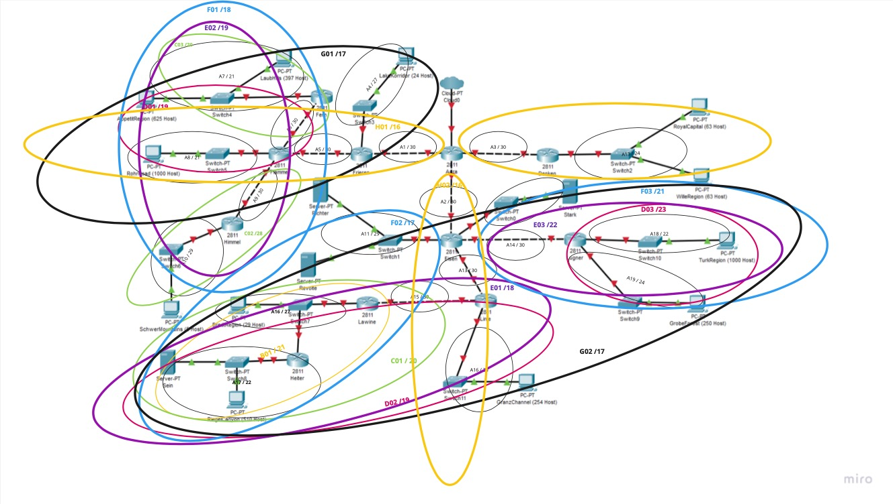

#### Gabungan Ketujuh Subnet H

- Penggabungan 1 : Gabungkan G01 dengan A1 menjadi satu subnet besar H01 dengan netmask /15
- Penggabungan 2 : Gabungkan G02 dengan A2 menjadi satu subnet besar H02 dengan netmask /15

#### Gabungan Kedelapan Subnet I

- Penggabungan 1 : Gabungkan H01 dengan H02 menjadi satu subnet besar I01 dengan netmask /14

#### Gabungan Kesembilan Subnet J

- Penggabungan 1 : Gabungkan I01 dengan A3 menjadi satu subnet besar J01 dengan netmask /13

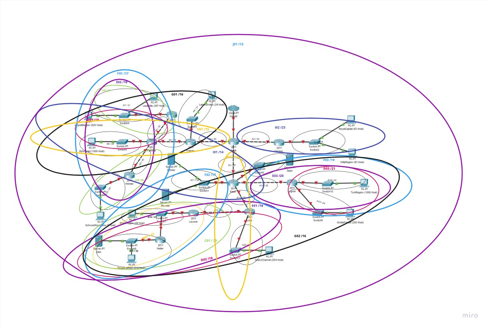

### Pohon IP

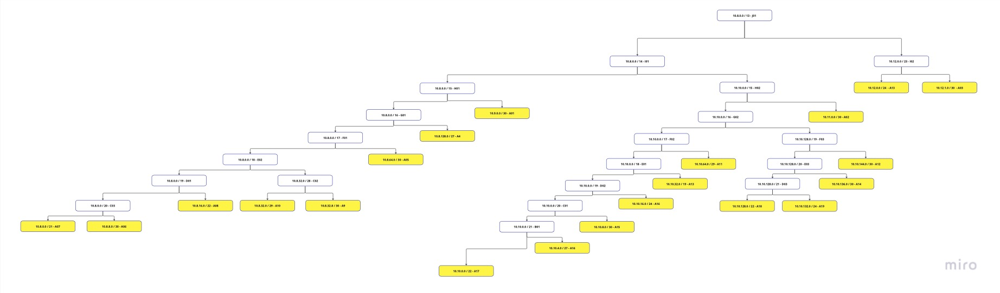

### Pembagian IP

| Subnet | Node             | IP          | Netmask         | Length | NID         | Broadcast     |
| ------ | ---------------- | ----------- | --------------- | ------ | ----------- | ------------- |
| A07    | Fern             | 10.8.0.1    | 255.255.248.0   | 21     | 10.8.0.0    | 10.8.7.255    |
| A07    | AppetionRegion   | 10.8.0.2    | 255.255.248.0   |        |             |               |
| A07    | Laubhils         | 10.8.0.3    | 255.255.248.0   |        |             |               |
|        |                  |             |                 |        |             |               |
| A06    | Fern             | 10.8.8.1    | 255.255.255.252 | 30     | 10.8.8.0    | 10.8.8.3      |
| A06    | Flame            | 10.8.8.2    | 255.255.255.252 |        |             |               |
|        |                  |             |                 |        |             |               |
| A08    | RohrRead         | 10.8.16.1   | 255.255.248.0   | 21     | 10.8.16.0   | 10.8.23.255   |
| A08    | Flamme           | 10.8.16.2   | 255.255.248.0   |        |             |               |
|        |                  |             |                 |        |             |               |
| A10    | SchewerMountains | 10.8.32.1   | 255.255.255.248 | 29     | 10.8.32.0   | 10.8.32.7     |
| A10    | Himmel           | 10.8.32.2   | 255.255.255.248 |        |             |               |
|        |                  |             |                 |        |             |               |
| A09    | Flamme           | 10.8.32.9   | 255.255.255.252 | 30     | 10.8.32.8   | 10.8.32.11    |
| A09    | Himmel           | 10.8.32.10  | 255.255.255.252 |        |             |               |
|        |                  |             |                 |        |             |               |
| A05    | Flamme           | 10.8.64.1   | 255.255.255.252 | 30     | 10.8.64.0   | 10.8.64.3     |
| A05    | Frieren          | 10.8.64.2   | 255.255.255.252 |        |             |               |
|        |                  |             |                 |        |             |               |
| A04    | Lakekoridor      | 10.8.128.1  | 255.255.255.224 | 27     | 10.8.128.0  | 10.8.128.31   |
| A04    | Frieren          | 10.8.128.2  | 255.255.255.224 |        |             |               |
|        |                  |             |                 |        |             |               |
| A01    | Frieren          | 10.9.0.1    | 255.255.255.252 | 30     | 10.9.0.0    | 10.9.0.3      |
| A01    | Aura             | 10.9.0.2    | 255.255.255.252 |        |             |               |
|        |                  |             |                 |        |             |               |
| A17    | Heiter           | 10.10.0.1   | 255.255.252.0   | 21     | 10.10.0.0   | 10.10.3.255   |
| A17    | Sein             | 10.10.0.2   | 255.255.252.0   |        |             |               |
| A17    | RiegelCannyon    | 10.10.0.3   | 255.255.252.0   |        |             |               |
|        |                  |             |                 |        |             |               |
| A16    | Lawine           | 10.10.4.1   | 255.255.255.224 | 27     | 10.10.4.0   | 10.10.4.31    |
| A16    | Heiter           | 10.10.4.2   | 255.255.255.224 |        |             |               |
| A16    | BredtRegion      | 10.10.4.3   | 255.255.255.224 |        |             |               |
|        |                  |             |                 |        |             |               |
| A15    | Linie            | 10.10.8.1   | 255.255.255.252 | 30     | 10.10.8.0   | 10.10.8.3     |
| A15    | Lawine           | 10.10.8.2   | 255.255.255.252 |        |             |               |
|        |                  |             |                 |        |             |               |
| A30    | Linie            | 10.10.16.1  | 255.255.255.0   | 24     | 10.10.16.0  | 10.10.16.255  |
| A30    | GranzChannel     | 10.10.16.2  | 255.255.255.0   |        |             |               |
|        |                  |             |                 |        |             |               |
| A13    | Eisen            | 10.10.32.1  | 255.255.255.252 | 30     | 10.10.32.0  | 10.10.32.3    |
| A13    | Linie            | 10.10.32.2  | 255.255.255.252 |        |             |               |
|        |                  |             |                 |        |             |               |
| A18    | Lugner           | 10.10.128.1 | 255.255.252.0   | 22     | 10.10.128.0 | 10.10.131.255 |
| A18    | TurkRegion       | 10.10.128.2 | 255.255.252.0   |        |             |               |
|        |                  |             |                 |        |             |               |
| A19    | Lugner           | 10.10.132.1 | 255.255.255.0   | 24     | 10.10.132.0 | 10.10.132.255 |
| A19    | GrobeForest      | 10.10.132.2 | 255.255.255.0   |        |             |               |
|        |                  |             |                 |        |             |               |
| A14    | Eisen            | 10.10.136.1 | 255.255.255.252 | 30     | 10.11.136.0 | 10.11.136.3   |
| A14    | Lugner           | 10.10.136.2 | 255.255.255.252 |        |             |               |
|        |                  |             |                 |        |             |               |
| A11    | Eisen            | 10.10.64.1  | 255.255.255.248 | 29     | 10.10.64.0  | 10.10.64.7    |
| A11    | Ricther          | 10.10.64.2  | 255.255.255.248 |        |             |               |
| A11    | Revolte          | 10.10.64.3  | 255.255.255.248 |        |             |               |
|        |                  |             |                 |        |             |               |
| A12    | Eisen            | 10.10.144.1 | 255.255.255.252 | 30     | 10.11.144.0 | 10.11.144.3   |
| A12    | Stark            | 10.10.144.2 | 255.255.255.252 |        |             |               |
|        |                  |             |                 |        |             |               |
| A02    | Aura             | 10.11.0.1   | 255.255.255.252 | 30     | 10.11.0.0   | 10.11.0.3     |
| A02    | Eisen            | 10.11.0.2   | 255.255.255.252 |        |             |               |
|        |                  |             |                 |        |             |               |
| A13    | Danken           | 10.12.0.1   | 255.255.255.0   | 24     | 10.12.0.0   | 10.12.0.255   |
| A13    | RoyalCapital     | 10.12.0.2   | 255.255.255.0   |        |             |               |
| A13    | WilleRegion      | 10.12.0.3   | 255.255.255.0   |        |             |               |
|        |                  |             |                 |        |             |               |
| A03    | Aura             | 10.12.1.1   | 255.255.255.252 | 30     | 10.12.1.0   | 10.12.1.3     |
| A03    | Danken           | 10.12.1.2   | 255.255.255.252 | 30     |             |               |

### CIDR Routing Check

https://github.com/robbypambudi/Jarkom-Modul-4-B13-2023/assets/34505233/16740793-6335-48c4-b406-5c98101e6823

### VLSM
VLSM adalah metode pengalamatan IP yang memungkinkan pengguna untuk menggunakan subnet mask dengan panjang yang berbeda-beda untuk mengoptimalkan penggunaan alamat IP.

### Pembagian IP
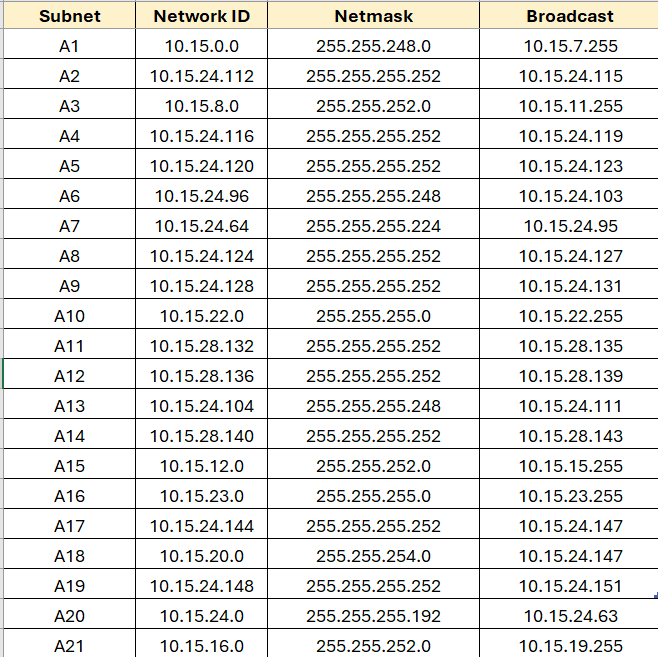
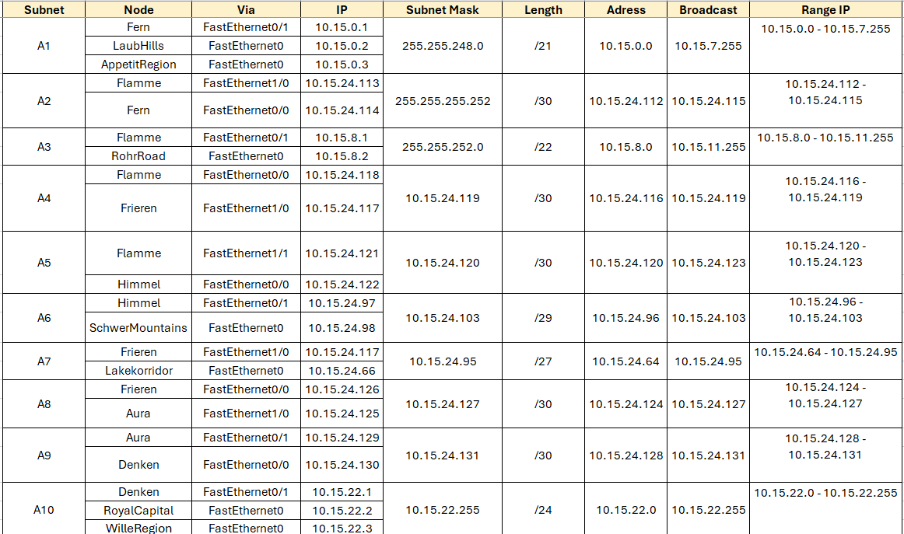

### Konfigurasi Network
Setelah membagi IP pada masing masing node setelah itu kita konfigurasi ip nya

ROUTER
- Pilihlah Router yang akan dikonfigurasi kemudian klik pada router tersebut.
- Klik config dan akan diberikan beberapa pilihan via dari fastethernet0/0 hingga fastethernet1/1 dan lakukan pembagian ip
- Memasukan IPv4Address dan Subnet Mask berdasarkan pembagian subnetting masing masing dan lakukan pada setiap router yang ada

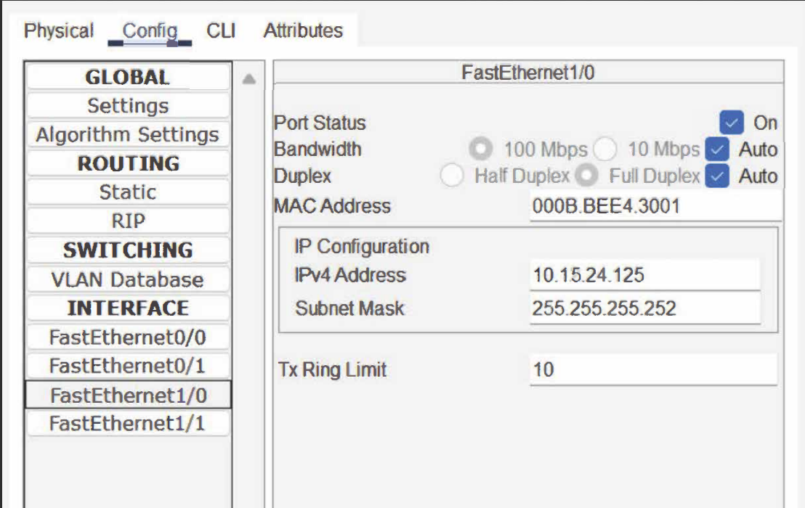

CLIENT atau SERVER
- Pilih Client/Server yang akan dikonfigurasi kemudian klik pada Client/Server tersebut.
- pilih dekstop untuk mencari pilihan ip configuration
- pilih ipconfiguration, setelah itu isi IPv4Address dan Subnet Mask
- Setelah itu konfigurasi berdasarkan pembagian ip yang telah ada diatas
- ulangi langkah yang sama pada setiap Client/Server yang ada

ROUTING
Routing statis adalah metode routing yang mengharuskan administrator jaringan untuk menambahkan rute baru secara manual ke tabel routing ketika terdapat subnet tambahan. Konsepnya sederhana, yaitu mendaftarkan NID dan netmask dari subnet, serta gateway untuk menuju subnet tersebut.

- Pilih Route yang akan di routing
- Pada menu Config terdapat pilihan Routing,  klik Static untuk menambahkan route pada Router yang terdiri dari Network, Mask, dan Next Hop
- Isi satu persatu route lalu Add hingga seluruh route dari router tersebut telah ditambah

Kiri
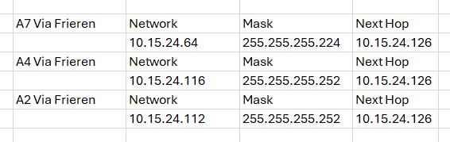

Begitu juga dengan bagian Kanan dan bawahnya

- Lalu lakukan pada setiap router.
